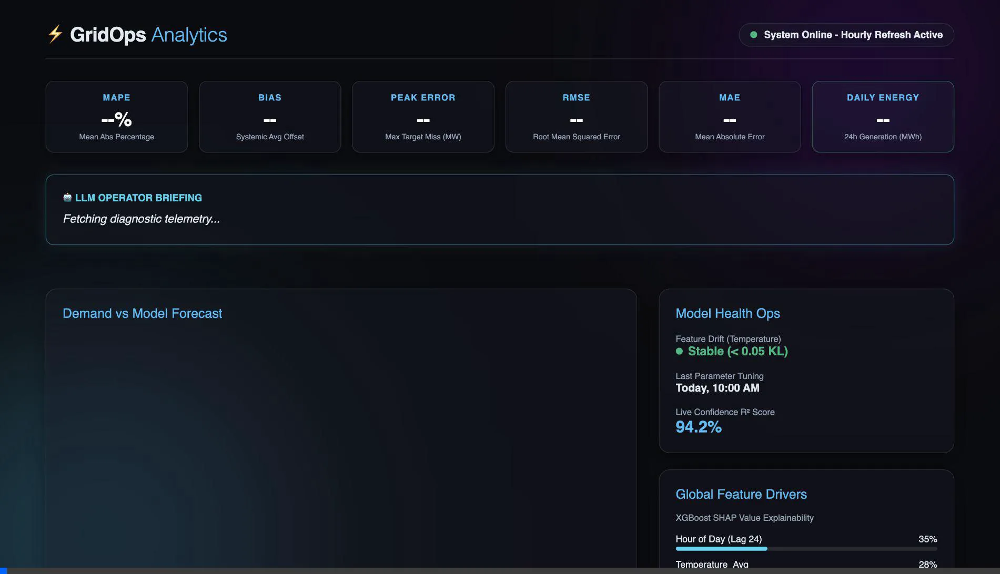

# GridOps: Electrical Load Forecasting & Anomaly Detection



GridOps is an end-to-end Machine Learning pipeline and interactive FastAPI dashboard designed to forecast short-term electricity demand and detect grid anomalies in real-time. By leveraging multivariate weather data and dynamic model selection, the platform provides actionable, highly accurate predictions to optimize generations scheduling and improve grid stability.

## 🚀 Key Features
*   **Dynamic Model Selection**: Automatically trains, evaluates, and selects the best-performing model (Random Forest, XGBoost, Linear SGD) based on a rolling 15-day validation window.
*   **Real-time Anomaly Detection**: Tracks actual vs. forecasted demand hourly, flagging significant deviations with calculated severity scores.
*   **Explainable AI (SHAP)**: Understand which features (hour of day, temperature, historical lags) are driving the prediction in real-time.
*   **Generative AI Operator Briefings**: Automatically translates complex anomalies into human-readable diagnostic reports for grid operators.
*   **Interactive Dashboard**: A responsive, dark-mode FastAPI monitoring UI featuring interactive charts, KPIs, and live health metrics.
*   **Fully Automated Pipeline**: Uses APScheduler to fetch live weather data, monitor actuals hourly, and generate the 24-hour forward projection daily at 10:00 AM.

## 🏗️ Architecture Stack
*   **Backend / API**: FastAPI (Python)
*   **Database**: PostgreSQL
*   **Machine Learning**: Scikit-Learn, XGBoost, Pandas, Numpy
*   **Frontend**: HTML5, Vanilla CSS, JavaScript (Chart.js)
*   **Deployment**: Ready for Render / Heroku via `render.yaml` Blueprint

---

## 📂 Repository Structure
```text
.
├── webapp/                 # FastAPI application, frontend static files, and APScheduler
│   ├── main.py             # Entry point for the Dashboard & Task Scheduler
│   ├── static/             # HTML, CSS, JS for the UI
├── kaggle.py               # Main pipeline: Generates 24h predictions & selects best model
├── train_forecast.py       # Benchmarking script for evaluating multiple models
├── build_monitoring.py     # Hourly pipeline tracking actual demand vs forecast
├── fct_alert.py            # Automated severity calculation and LLM bridging
├── render.yaml             # Render Blueprint for automated cloud deployment
├── requirements.txt        # Python dependencies
└── *.sh                    # Bash scripts to execute Python workflows
```

---

## 🛠️ Getting Started

### 1. Prerequisites
Ensure you have Python 3.9+ and PostgreSQL installed on your machine.
Clone the repository:
```bash
git clone https://github.com/Ocalak/de-load-forecast.git
cd de-load-forecast
```

### 2. Environment Setup
Install the required dependencies:
```bash
pip install -r requirements.txt
```

Create a `.env` file in the root directory configured for your PostgreSQL database:
```env
DB_HOST=localhost
DB_PORT=5432
DB_NAME=your_db_name
DB_USER=your_postgres_user
DB_PASSWORD=your_password
```

### 3. Running the Pipeline & Dashboard
The entire system operates out of the FastAPI application, which manages the background scheduling.
```bash
cd webapp
uvicorn main:app --host 0.0.0.0 --port 8000
```
Visit `http://localhost:8000` in your browser. 
*The dashboard will automatically execute the daily forecast at 10:00 AM and track telemetry at the top of every hour.*

---

## ☁️ Deploying to the Cloud (Render)
This repository includes a `render.yaml` Blueprint for single-click deployment.
1. Create a free account on [Render](https://render.com/).
2. Click **New +** -> **Blueprint**.
3. Connect your GitHub repository.
4. Render will automatically provision your PostgreSQL database and launch the FastAPI web service without any manual configuration!

## 📈 Performance Summary
The pipeline was evaluated on historical German grid load data (DE). The pipeline dynamically selected the **Random Forest** algorithm, achieving:
*   **RMSE**: 1.8 GW
*   **MAPE**: ~2.19%
*   **R² Score**: 0.94

## 🤝 Contributing
Contributions, issues, and feature requests are welcome! Feel free to check the issues page.

## 📄 License
This project is open-source and available under the MIT License.
